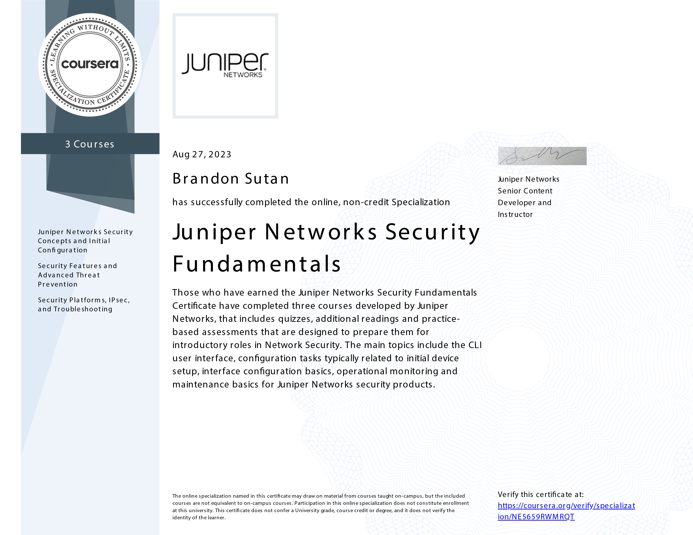

# Juniper Networks Security Fundamentals Specialization - Completed

🎉 I'm thrilled to announce that I've completed the Juniper Networks Security Fundamentals Specialization offered by Act Now Education. This journey has been enlightening and rewarding, and I'm excited to share my achievements and experiences.

## Specialization Overview

- **Total Courses:** 3
- **Total Duration:** 24 hours
- **Average Rating:** 5.0

## Key Takeaways

Throughout this specialization, I've gained a solid foundation in configuring Juniper security solutions and understanding the intricacies of network security. Some of the key takeaways from my journey include:

- **Configuration Proficiency:** I can confidently configure initial systems, interfaces, security objects, policies, IPsec VPNs, and NAT configurations.
- **Deep Understanding:** My knowledge of security objects, policies, and services has expanded significantly, allowing me to design more robust security architectures.
- **Troubleshooting Skills:** I've acquired the skills to troubleshoot security platforms and IPsec VPNs effectively, ensuring smooth network operations.
- **Applied Learning:** The hands-on projects and quizzes provided practical experience, enhancing my ability to apply theoretical knowledge in real-world scenarios.

## Gratitude

I am grateful to Act Now Education for offering this comprehensive and insightful specialization. Additionally, I'd like to thank the instructors and mentors who contributed their expertise, making this learning journey engaging and impactful.

## What's Next

Completing this specialization, I'm excited to explore further advancements in cybersecurity. I'll be looking for opportunities to apply my newfound knowledge and skills in real-world projects and challenges. Stay tuned for more updates on my journey!

## Connect with Me

If you'd like to connect, discuss cybersecurity, or share experiences, feel free to reach out to me through the following platforms:

- GitHub: [Brandon Sutan](https://github.com/brandonsutan)
- LinkedIn: [Brandon Sutan](https://www.linkedin.com/in/brandonsutan/)
- Portfolio: [Brandon Sutan](https://brandonsutan.github.io/)

Thank you for being a part of this incredible journey with me. Here's to continued learning and growth! 🚀

_"The only source of knowledge is experience." - Albert Einstein_
