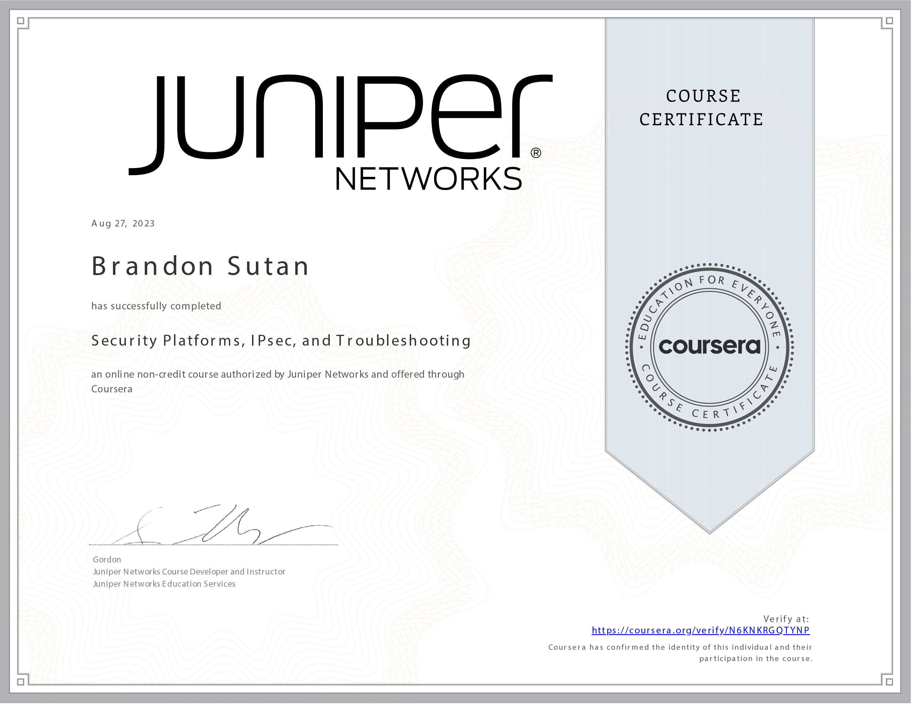

# Security Platforms, IPsec, and Troubleshooting - Completed

I'm thrilled to announce that I've completed the **Security Platforms, IPsec, and Troubleshooting** course within the Juniper Networks Security Fundamentals Specialization! This course has been an eye-opening experience, and I'm excited to share my insights and achievements.

## Course Overview

- **Course:** Security Platforms, IPsec, and Troubleshooting
- **Duration:** 9 hours
- **Instructor:** Gordon
- **My Rating:** 5.0

## Valuable Learnings

This course has given me a wealth of knowledge in security platforms, IPsec VPNs, and effective troubleshooting strategies. Some of the invaluable takeaways from this course include:

- **IPsec VPNs:** Comprehensive understanding of IPsec VPNs, from their functionality to configuration, implementation, and monitoring.
- **Juniper Secure Connect:** Exploring Juniper's SSL VPN application, Juniper Secure Connect, including features, deployment, and monitoring.
- **SRX Series Troubleshooting:** Mastering troubleshooting, monitoring, and maintenance for SRX Series devices.
- **Device Overview:** Gaining insights into different types of SRX Series devices and interfaces.

## Course Contents

- Understanding IPsec VPNs and Their Functionality
- Configuration, Implementation, and Monitoring of IPsec VPNs
- Exploring Juniper Secure Connect (SSL VPN Application)
- Troubleshooting, Monitoring, and Maintenance of SRX Series Devices
- Overview of Different Types of SRX Series Devices and Interfaces

## Next Steps

Completing this course marks a significant milestone in my journey to becoming a Juniper Networks Security Professional. I'm enthusiastic about further honing my skills and knowledge, and I'm excited to apply what I've learned to real-world scenarios.

Thank you for accompanying me on this educational endeavor. Here's to continued growth and success in the world of network security! 🚀🛡️
